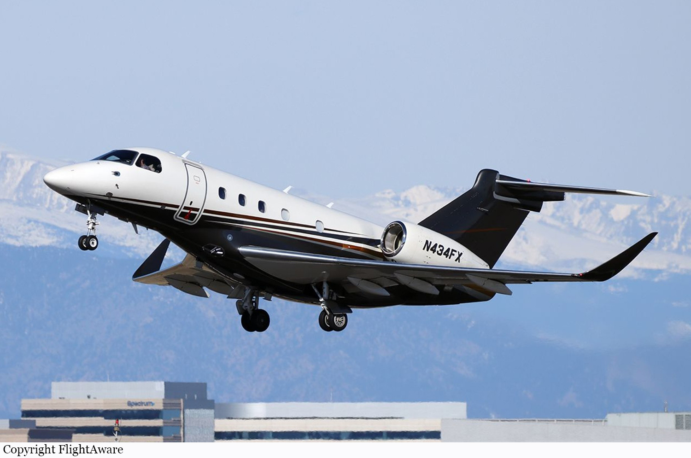
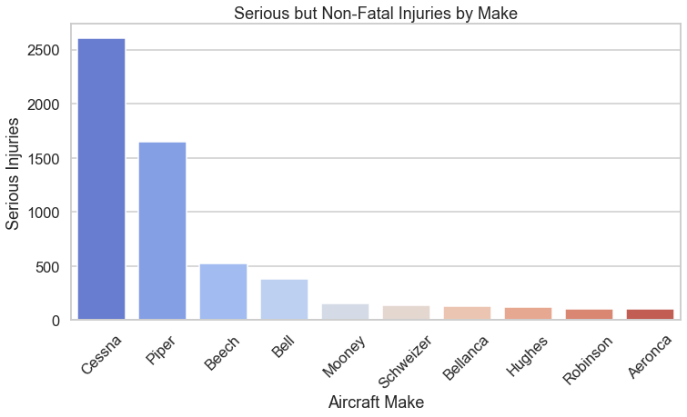
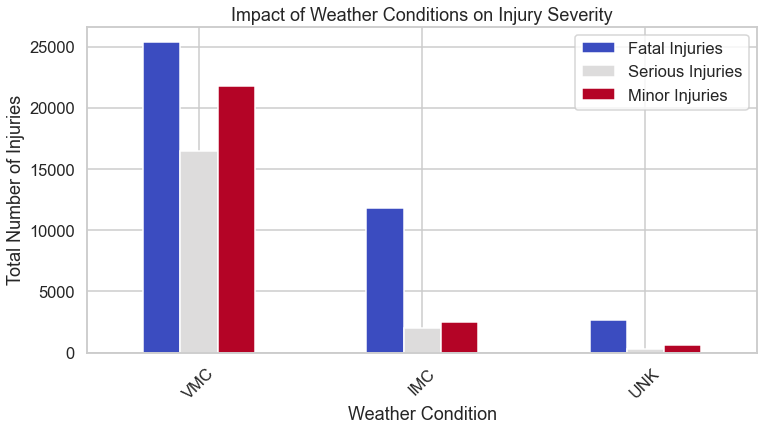
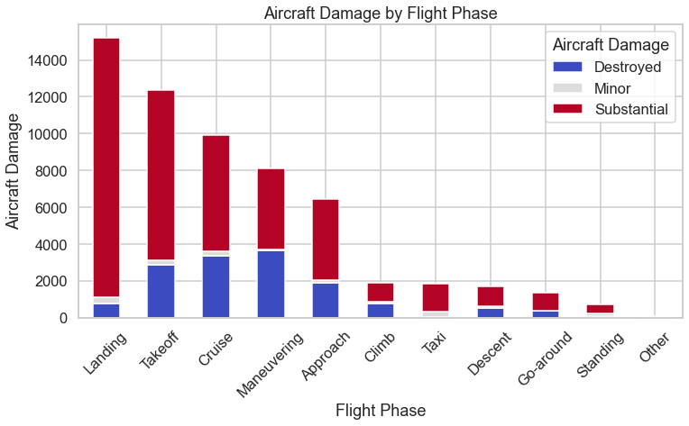
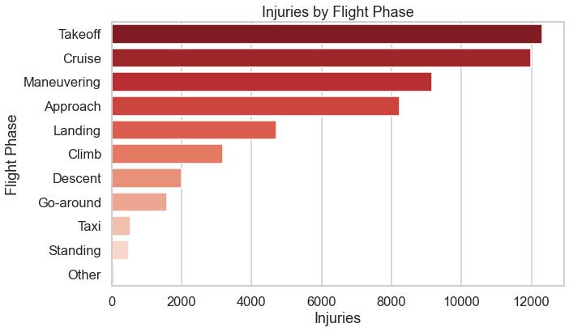

# Aviation Accident Analysis




**Author:** [Diana Mayalo](https://github.com/DianaMayalo)
# Overview
My project analyzes aviation accident data to identify risk factors affecting severity, aircraft damage, and injuries. By analyzing historical accident data, I aim to answer key business questions:
## Key Business Questions
1.	How do weather conditions influence the severity of injuries?
2.	Which aircraft manufacturers have a high proportion of serious but non-fatal accidents?
3.	What impact do different flight phases have on aircraft damage?
## Stakeholders
- Aviation regulatory authorities
- Aircraft manufacturers
- Airline operators
- Safety investigators
# Data Understanding and Analysis
## Source of data
This data comes from [The NTSB aviation accident dataset up to Feb 2021](https://www.kaggle.com/datasets/khsamaha/aviation-accident-database-synopses)

I used 7 columns for this analysis, which included variables about:
- `Event.Id`: Date of the accident.
- `Make`: Company that produced the aircraft.
- `Total.Fatal.Injuries`,`Total.Serious.Injuries`,`Total.Minor.Injuries`: Classification of accident severity
- `Broad.phase.of.flight`: Phase of flight during which the accident occurred.
- `Weather.Condition`: Atmospheric conditions at the time of the accident.
- `Aircraft.damage`: Extent of damage sustained by the aircraft.

# Visualizations
 
Visual meteorological conditions (VMC) and instrument meteorological conditions (IMC) weather conditions cause more fatal injuries.



Cessna and Piper manufacturers have more serious but non-fatal accidents




Maneuvering and Cruise phases cause the most aircraft damage. Landing and Takeoff lead to more substantial damage. 



Takeoff and cruise flight phases have the highest injuries



# Conclusion
1. Weather plays a major role in the severity of aviation accidents.
    - Fatal injuries are worse in visual meteorological conditions (VMC) and instrument meteorological conditions (IMC)
    - Last-minute maneuvers and poor visibility lead to high-speed crashes, causing more fatal injuries

    **Recommendation**: Improve pilot training for decision-making in poor weather conditions.

2. Some aircraft types may have higher accident rates due to operational or maintenance factors.
    - This suggests maintenance issues that require attention to reduce injuries.

    **Recommendation**: Conduct targeted safety inspections and maintenance improvements for Cessna and Piper aircraft.

3.  Different flight phases pose unique risks that impact aircraft damage severity.
    - Maneuvering and Cruise phases have the most destroyed aircraft due to mid-air crashes and loss of control.
    - Landing and Takeoff cause more substantial damage from gear failures or runway overruns.

 **Recommendation**: Enhance safety measures during Maneuvering and Cruise phases to prevent complete aircraft destruction.
# Next Steps
Further analyses could yield additional insights to further improve operations:
- Investigate why Cessna and Piper have higher non-fatal accident rates
- Explore pilot decision-making and training in VMC and IMC conditions
- Assess potential safety improvements in Maneuvering and Cruise phases
  
# For More Information

For additional info, contact: [Diana Mayalo](dianamayalo28@gmail.com)


# Repository Structure
```
Phase-1-Project-Moringa-School/
│-- 📂 Images/
|   |-- Aircraft.jpg
|   |-- aircraft_damage_by_flight_phase.png 
│   │-- injuries_by_flight_phase.png        
│   │-- serious_non-fatal_injuries_by_make.png 
|   |-- weather_condition_by_injuries.png        
│-- 📂 data/
│   │-- AviationData.csv     
│   │-- AviationData_Cleaned.csv      
│   │-- USState_Codes.csv   
│-- 📂 notebook/
│   │-- Aviation.ipynb 
|-- .gitignore 
|-- AviationVizz.twb           
│-- README.md                   
```
