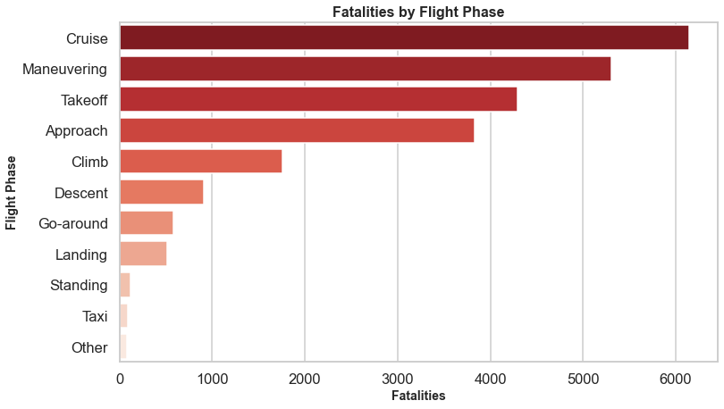

# Aviation Safety Analysis


**Author:** [Diana Mayalo](https://github.com/DianaMayalo)
# Overview
Air travel is considered one of the safest modes of transportation, but accidents still occur. In my analysis, I aim to identify the safest aircraft by examining accident data and identifying trends related to fatalities, injuries, and aircraft damage. I aim to answer key business questions:
## Key Business Questions
1. **Aircraft Damage Distribution by Make** – Understanding how often different aircraft makes sustain serious damage. 
2. **Fatalities by Phase of Flight** – Identifying the which flight phases have the most fatalities 
3. **Fatality Rate by Aircraft Model** – Identify which aircraft models have the highest fatalities.  
4. **Total Uninjured Persons by Aircraft Make** – Identify the aircraft make with no injuries. 
## Stakeholders
The insights from this analysis are valuable to stakeholders in the aviation industry including:
- Aviation regulatory authorities
- Aircraft manufacturers
- Airline operators
- Safety investigators
# Data Understanding and Analysis
## Source of data
In the data folder is a [dataset](https://www.kaggle.com/datasets/khsamaha/aviation-accident-database-synopses) from the National Transportation Safety Board that includes aviation accident data from 1962 to 2023 about civil aviation accidents and selected incidents in the United States and international waters.

I used 8 columns for this analysis, which included variables about:
- **Aircraft Details**  
  - `Make`: The aircraft manufacturer.  
  - `Model`: The specific aircraft model.  

- **Injury and Fatality Data**  
  - `Total.Fatal.Injuries`: Number of fatalities in an accident.  
  - `Total.Serious.Injuries`: Number of serious injuries.  
  - `Total.Minor.Injuries`: Number of minor injuries.  
  - `Total.Uninjured`: Number of people who were not injured.  

- **Flight and Accident Information**  
  - `Aircraft.damage`: The extent of damage to the aircraft.  
  - `Broad.phase.of.flight`: The phase of flight during which the accident occurred.  

# Results
 
- Cessna and Piper show the highest number of aircraft damage cases, with a large portion destroyed and substantial damages. This suggests that smaller small aviation aircraft may be more prone to severe damage compared to larger commercial aircraft. 


- The cruise phase has the highest fatalities (more than 6,000 cases). The maneuvering phase follows, with over 5,000 fatalities. Mid-flight incidents, particularly during cruise and maneuvering phases, account for the highest fatality counts.




- Boeing 737 has the highest fatalities (approximately 1350 cases) maybe because it is the the most widely used commercial aircraft. 737-200 also has significant fatalities which is an older generation model tending to have higher accident rates due to outdated systems.


- Boeing has the highest number of uninjured persons, exceeding 100,000 due to their stringent airline safety measures.


# Conclusion
- **Enhance safety measures for general aviation aircraft** – Cessna and Piper experience the highest damage rates, indicating a need for improved crash resistance, pilot training, and maintenance protocols for smaller aircraft.

- **Increase focus on critical flight phases** – The cruise and maneuvering phases account for the most fatalities, suggesting that airlines and regulators should prioritize safety enhancements, pilot training, and in-flight emergency preparedness during these phases.

- **Investigate accident trends in widely used aircraft** – The Boeing 737 has the highest fatalities, likely due to its widespread use. Further analysis of older aircraft models can help identify patterns and improve design standards for future fleets.

- **Leverage industry best practices to improve survivability** – Boeing and Cessna have the highest number of uninjured passengers, indicating that aircraft design, emergency procedures, and airline safety protocols play a key role in passenger survival. Expanding these best practices to other manufacturers could further enhance overall aviation safety.

# Next Steps
1. Investigate contributing factors to high damage rates in small aircrafts.
2. Enhance safety protocols during critical flight phases.
3. Focus on improving survivability for aircraft with lower uninjured rates.
  
# For More Information

For additional info, contact: [Diana Mayalo](dianamayalo28@gmail.com)

🚀 **Explore More in Tableau:** [Interactive Dashboard](https://public.tableau.com/views/AircraftSafetyAnalysis_17431527776500/AviationDashboard?:language=en-US&:sid=&:redirect=auth&:display_count=n&:origin=viz_share_link)

# Repository Structure
```
Phase-1-Project-Moringa-School/
│-- 📂 Images/
|   |-- Aircraft.jpg
|   |-- aircraft_damage_by_make.png 
│   │-- fatalities_by_flight_phase.png       
│   │-- fatality_rate_by_aircraft_model.png 
|   |-- total_injured_by_manufacturer.png        
│-- 📂 data/
│   │-- AviationData.csv     
│   │-- cleaned_aviation_data.csv      
│   │-- USState_Codes.csv   
│-- 📂 notebook/
│   │-- AviationAnalysis.ipynb 
|   |-- notebook.pdf
|-- .gitignore 
|-- Aviation_Vizz.twb           
│-- README.md  
|-- presentation.pdf
|-- github.pdf              
```
