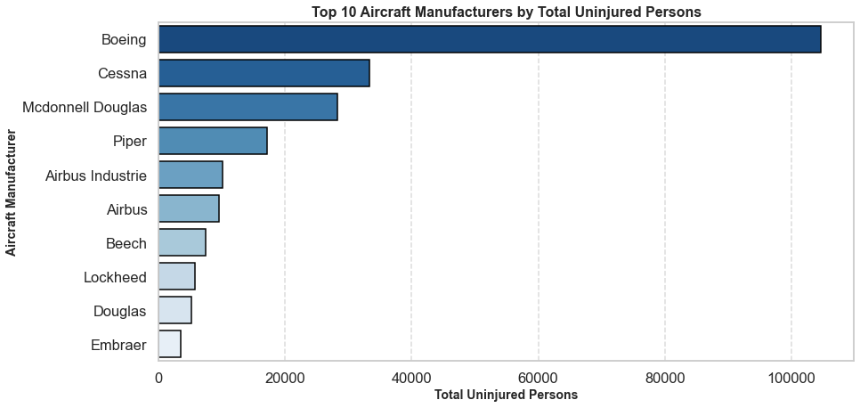

# Aviation Accident Analysis


**Author:** [Diana Mayalo](https://github.com/DianaMayalo)
# Overview
Air travel is considered one of the safest modes of transportation, but accidents still occur. In my analysis, I aim to identify the safest aircraft by examining accident data and identifying trends related to fatalities, injuries, and aircraft damage. By analyzing historical accident data, I aim to answer key business questions:
## Key Business Questions
1. **Aircraft Damage Distribution by Manufacturer** – Understanding how often aircraft sustain serious damage. 
2. **Fatalities by Phase of Flight** – Identifying when most fatal accidents occur. 
3. **Fatality Rate by Aircraft Model** – Comparing different aircraft models based on fatalities.  
4. **Total Uninjured Persons by Aircraft Make** – Highlighting manufacturers with the safest aircraft. 
## Stakeholders
- Aviation regulatory authorities
- Aircraft manufacturers
- Airline operators
- Safety investigators
# Data Understanding and Analysis
## Source of data
This data comes from [Kaggle](https://www.kaggle.com/datasets/khsamaha/aviation-accident-database-synopses)

I used 8 columns for this analysis, which included variables about:
- **Aircraft Details**  
  - `Make`: The aircraft manufacturer.  
  - `Model`: The specific aircraft model.  

- **Injury and Fatality Data**  
  - `Total.Fatal.Injuries`: Number of fatalities in an accident.  
  - `Total.Serious.Injuries`: Number of serious injuries.  
  - `Total.Minor.Injuries`: Number of minor injuries.  
  - `Total.Uninjured`: Number of people who were not injured.  

- **Flight and Accident Information**  
  - `Aircraft.damage`: The extent of damage to the aircraft.  
  - `Broad.phase.of.flight`: The phase of flight during which the accident occurred.  

# Visualizations
 
- Cessna and Piper show the highest number of aircraft damage cases, with a large portion destroyed and substantial damages.
- This suggests that smaller general aviation aircraft may be more prone to severe damage compared to larger commercial aircraft. 


- The cruise phase has the highest fatalities (more than 6,000 cases).
- The maneuvering phase follows, with over 5,000 fatalities.
- Mid-flight incidents, particularly during cruise and maneuvering phases, account for the highest fatality counts.


- Boeing 737 has the highest fatalities (approximately 1350 cases) - maybe because it is the the most widely used commercial aircraft.
-  737-200 also has significant fatalities (is an older generation model tending to have higher accident rates due to outdated systems) 


- Boeing has the highest number of uninjured persons, exceeding 100,000 maybe due to airline safety measures.



# Conclusion
- **Aircraft Damage Distribution by Manufacturer**: Cessna and Piper aircraft experience the highest damage rates, showing that general aviation aircraft tend to sustain more significant damage in accidents.

- **Fatalities by Phase of Flight**: The cruise and maneuvering phases account for the most fatalities, highlighting critical phases where fatal incidents are more frequent.

- **Fatality Rate by Aircraft Model**: The Boeing 737 has the highest fatalities, potentially due to its widespread use, with older models also showing significant accident data.

- **Total Uninjured Persons by Aircraft Make**: Boeing, Cessna, and McDonnell Douglas record the highest number of uninjured passengers, reflecting trends in survivability across different aircraft types.

# Next Steps
1. Enhance safety features and training for high-risk aircraft and Phases
2. Investigate factors contributing to high fatality rates in Boeing 737 and older Aircraft models
3. Focus on improving survivability for aircraft with lower uninjured rates
  
# For More Information

For additional info, contact: [Diana Mayalo](dianamayalo28@gmail.com)


# Repository Structure
```
Phase-1-Project-Moringa-School/
│-- 📂 Images/
|   |-- Aircraft.jpg
|   |-- aircraft_damage_by_make.png 
│   │-- fatalities_by_flight_phase.png       
│   │-- fatality_rate_by_aircraft_model.png 
|   |-- total_injured_by_manufacturer.png        
│-- 📂 data/
│   │-- AviationData.csv     
│   │-- cleaned_aviation_data.csv      
│   │-- USState_Codes.csv   
│-- 📂 notebook/
│   │-- AviationAnalysis.ipynb 
|-- .gitignore 
|-- AviationVizz.twb           
│-- README.md                   
```
